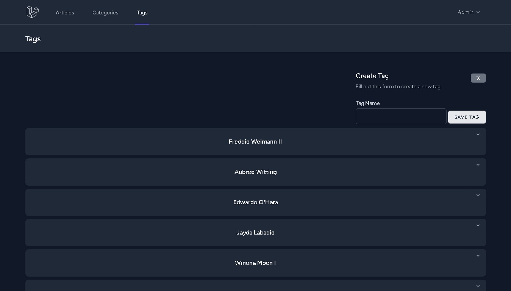
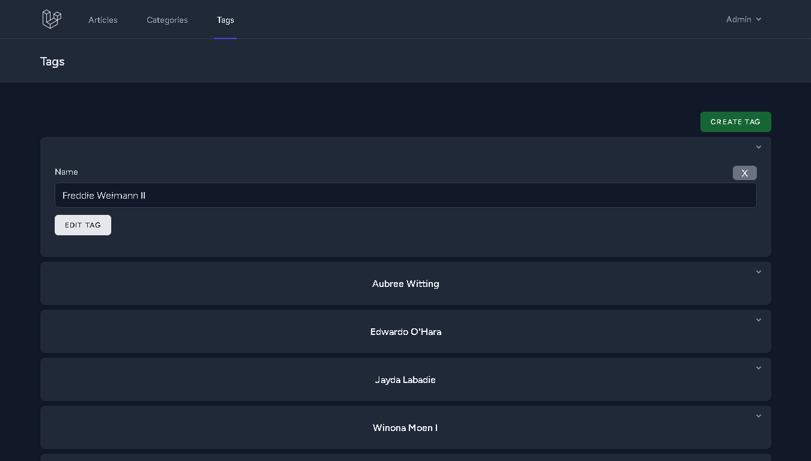

# Laravel personal blog
This project is my implementation of the requirements described at [Laravel Roadmap Beginner Challenge](https://github.com/LaravelDaily/Laravel-Roadmap-Beginner-Challenge).

# Instalation
You'll need a working MySQL instance to run this project. Create a .env file with your connection credentials. You can copy the .env.example file at this project's root directory, rename it to .env, and edit the variables accordingly.

```
git clone https://github.com/leandrorsant/Laravel-Roadmap-Personal-Blog
cd Laravel-Roadmap-Personal-Blog
npm i
composer install
npm run dev
php artisan migrate
php artisan serve
```

If you wish to populate the database with random data:
```
php artisan db:seed
```


# Screenshots




